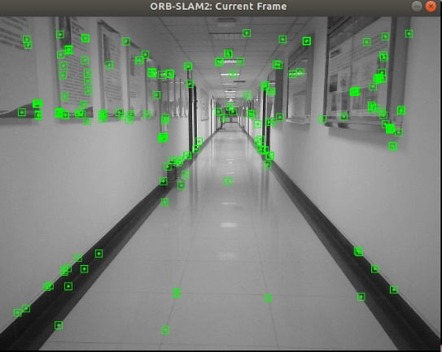

# Raspberry-SLAM-Robot
<p align="center">
  
  
  
</p>

## 项目简介

`Raspberry-SLAM-Robot` 是一个基于树莓派和 ORB-SLAM2 开源算法的移动机器人 SLAM 原型系统。该机器人搭载了改进的ORB-SLAM2算法，实现了机器人在未知环境中的自主导航、实时建图以及定位。项目的目标是构建一个轻量级且高效的 SLAM 系统，能够在不同的环境中进行自主探索，并为科研人员、学生以及开发者提供一个开源的实验平台，用于进一步的算法研究和优化。


## 项目结构
```bash
orbslam2-robot-devlog/
├── README.md               # 项目介绍，结构、算法、使用方法等
├── docs/                   # 记录说明文档
│   ├── hardware.md         # 机器人结构设计图
│   ├── devlog.md           # 每日开发日志
│   └── images/             # 所有图片截图放这
├── slam/                   
│   └── orbslam2/           
├── scripts/                
├── .gitignore
├── LICENSE
└── CONTRIBUTING.md
```

## 系统概述
<p align="center">
  
</p>
<p align="center"> 
  <b>系统概述</b>
</p>
---
## 安装与使用

### 1. 安装依赖

在树莓派上，首先需要安装必要的软件依赖：

```bash
sudo apt update
sudo apt install libeigen3-dev
sudo apt install libopencv-dev
sudo apt install libboost-all-dev
sudo apt install libsdl1.2-dev
sudo apt install libvtk6-dev
sudo apt install ros-melodic-ros-base
```

### 2.克隆代码
```bash
git clone https://github.com/yzh317179958/raspberry-slam-robot.git
cd raspberry-slam-robot
```

### 3 编译代码
```bash
本项目基于ORB-SLAM2进行优化改进，请根据ORB-SLAM2官方文档进行编译
```

### 4.运行
```bash
roslaunch orb_slam2 slam.launch
```
### 5.运行效果
<p align="center">
  
  
</p>
